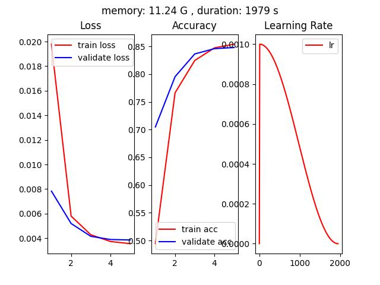
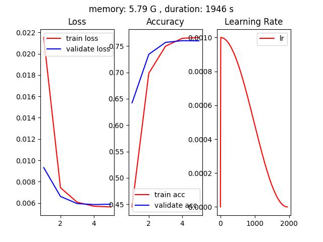
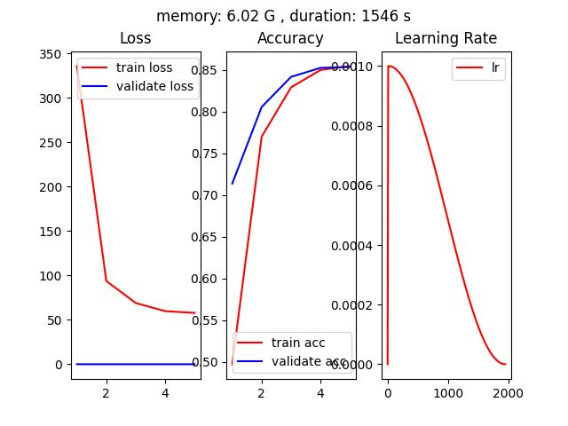
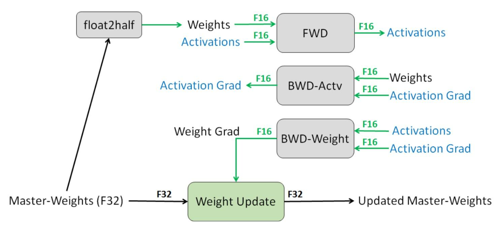
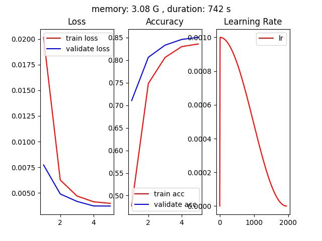
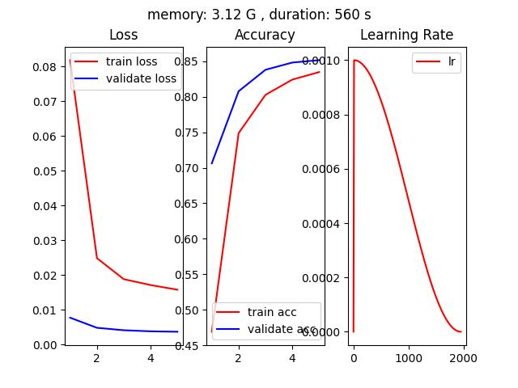
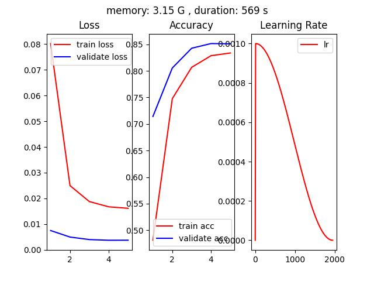
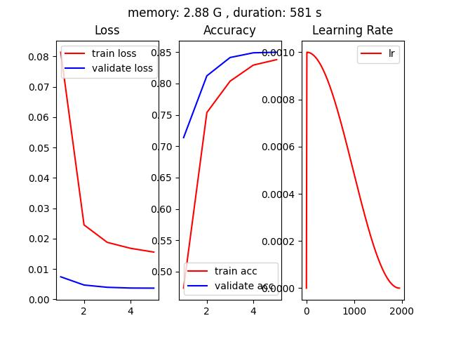
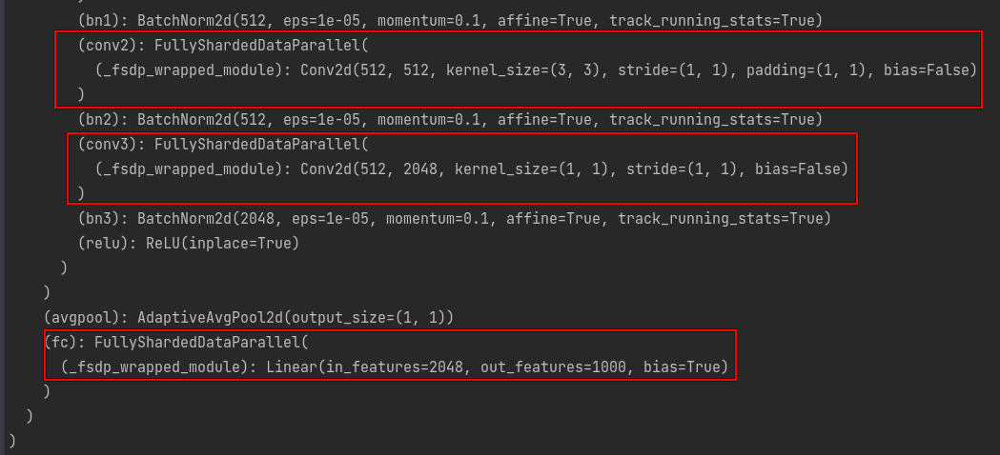
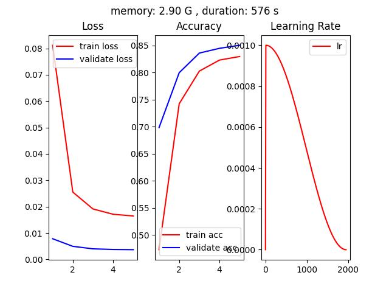

pytorch单精度、半精度、混合精度、单卡、多卡（DP / DDP）、FSDP、DeepSpeed模型训练代码，并对比不同方法的训练速度以及GPU内存的使用

---

### **FairScale（你真的需要FSDP、DeepSpeed吗？）**

在了解各种训练方式之前，先来看一下 FairScale 给出的一个模型训练方式选择的流程，选择适合自己的方式，就是最好的。


---

### **训练环境设置**
* 模型：预训练的Resnet50
* 数据集：Cifar10
* 硬件资源：一台4卡Tesla P40
* 训练设置：5 epoch、128 batch size
* 观察指标：显存占用、GPU使用率、训练时长、模型训练结果

**备注：** 
1. 由于P40硬件限制，不支持半精度fp16的训练，在fp16条件下训练的速度会受到影
响
2. ResNet50模型较小，batch_size=1时单卡仅占用 0.34G显存，绝大部分显存都被输入数据，以及中间激活占用

---

### **测试基准（batch_size=1）**
* 单卡显存占用：0.34 G
* 单卡GPU使用率峰值：60%

---

### **单卡单精度训练**
* 代码文件：pytorch_SingleGPU.py
* 单卡显存占用：11.24 G
* 单卡GPU使用率峰值：100%
* 训练时长（5 epoch）：1979 s
* 训练结果：准确率85%左右



---

### **单卡半精度训练**
* 代码文件：pytorch_half_precision.py
* 单卡显存占用：5.79 G
* 单卡GPU使用率峰值：100%
* 训练时长（5 epoch）：1946 s
* 训练结果：准确率75%左右



**备注：** 单卡半精度训练的准确率只有75%，单精度的准确率在85%左右

---

### **单卡混合精度训练**

[AUTOMATIC MIXED PRECISION PACKAGE - TORCH.AMP](https://pytorch.org/docs/stable/amp.html#torch.autocast)

[CUDA AUTOMATIC MIXED PRECISION EXAMPLES](https://pytorch.org/docs/stable/notes/amp_examples.html#amp-examples)

[PyTorch 源码解读之 torch.cuda.amp: 自动混合精度详解](https://zhuanlan.zhihu.com/p/348554267)

[如何使用 PyTorch 进行半精度、混(合)精度训练](https://blog.csdn.net/qq_44089890/article/details/130471991)

[如何使用 PyTorch 进行半精度训练](https://blog.csdn.net/qq_39845931/article/details/121671342)

[pytorch模型训练之fp16、apm、多GPU模型、梯度检查点（gradient checkpointing）显存优化等](https://zhuanlan.zhihu.com/p/448395808)

[Working with Multiple GPUs](https://pytorch.org/docs/stable/notes/amp_examples.html#amp-multigpu)

* 代码文件：pytorch_auto_mixed_precision.py
* 单卡显存占用：6.02 G
* 单卡GPU使用率峰值：100%
* 训练时长（5 epoch）：1546 s
* 训练结果：准确率85%左右



* 混合精度训练过程



* 混合精度训练基本流程
1. 维护一个 FP32 数值精度模型的副本
2. 在每个iteration
    * 拷贝并且转换成 FP16 模型
    * 前向传播（FP16 的模型参数）
    * loss 乘 scale factor s
    * 反向传播（FP16 的模型参数和参数梯度）
    * 参数梯度乘 1/s
    * 利用 FP16 的梯度更新 FP32 的模型参数

* autocast结合GradScaler用法
```
# Creates model and optimizer in default precision
model = Net().cuda()
optimizer = optim.SGD(model.parameters(), ...)

# Creates a GradScaler once at the beginning of training.
scaler = GradScaler()

for epoch in epochs:
    for input, target in data:
        optimizer.zero_grad()

        # Runs the forward pass with autocasting.
        with autocast(device_type='cuda', dtype=torch.float16):
            output = model(input)
            loss = loss_fn(output, target)

        # Scales loss.  Calls backward() on scaled loss to create scaled gradients.
        # Backward passes under autocast are not recommended.
        # Backward ops run in the same dtype autocast chose for corresponding forward ops.
        scaler.scale(loss).backward()

        # scaler.step() first unscales the gradients of the optimizer's assigned params.
        # If these gradients do not contain infs or NaNs, optimizer.step() is then called,
        # otherwise, optimizer.step() is skipped.
        scaler.step(optimizer)

        # Updates the scale for next iteration.
        scaler.update()
```

* 基于GradScaler进行梯度裁剪
```
scaler.scale(loss).backward()
scaler.unscale_(optimizer)
torch.nn.utils.clip_grad_norm_(model.parameters(), max_norm)
scaler.step(optimizer)
scaler.update()
```

* autocast用法
```
# Creates some tensors in default dtype (here assumed to be float32)
a_float32 = torch.rand((8, 8), device="cuda")
b_float32 = torch.rand((8, 8), device="cuda")
c_float32 = torch.rand((8, 8), device="cuda")
d_float32 = torch.rand((8, 8), device="cuda")

with torch.autocast(device_type="cuda"):
    # torch.mm is on autocast's list of ops that should run in float16.
    # Inputs are float32, but the op runs in float16 and produces float16 output.
    # No manual casts are required.
    e_float16 = torch.mm(a_float32, b_float32)
    # Also handles mixed input types
    f_float16 = torch.mm(d_float32, e_float16)

# After exiting autocast, calls f_float16.float() to use with d_float32
g_float32 = torch.mm(d_float32, f_float16.float())
```

* autocast嵌套使用
```
# Creates some tensors in default dtype (here assumed to be float32)
a_float32 = torch.rand((8, 8), device="cuda")
b_float32 = torch.rand((8, 8), device="cuda")
c_float32 = torch.rand((8, 8), device="cuda")
d_float32 = torch.rand((8, 8), device="cuda")

with torch.autocast(device_type="cuda"):
    e_float16 = torch.mm(a_float32, b_float32)
    with torch.autocast(device_type="cuda", enabled=False):
        # Calls e_float16.float() to ensure float32 execution
        # (necessary because e_float16 was created in an autocasted region)
        f_float32 = torch.mm(c_float32, e_float16.float())

    # No manual casts are required when re-entering the autocast-enabled region.
    # torch.mm again runs in float16 and produces float16 output, regardless of input types.
    g_float16 = torch.mm(d_float32, f_float32)
```

---

### **4卡 DP（Data Parallel）**
* 代码文件：pytorch_DP.py
* 单卡显存占用：3.08 G
* 单卡GPU使用率峰值：99%
* 训练时长（5 epoch）：742 s
* 训练结果：准确率85%左右



---

### **4卡 DDP（Distributed Data Parallel）**

[pytorch-multi-gpu-training
/ddp_train.py](https://github.com/jia-zhuang/pytorch-multi-gpu-training/blob/master/ddp_train.py)

[DISTRIBUTED COMMUNICATION PACKAGE - TORCH.DISTRIBUTED](https://pytorch.org/docs/stable/distributed.html)

[DISTRIBUTED DATA PARALLEL](https://pytorch.org/docs/stable/notes/ddp.html)

[[原创][深度][PyTorch] DDP系列第一篇：入门教程](https://zhuanlan.zhihu.com/p/178402798)

[[原创][深度][PyTorch] DDP系列第二篇：实现原理与源代码解析](https://zhuanlan.zhihu.com/p/187610959)

[[原创][深度][PyTorch] DDP系列第三篇：实战与技巧](https://zhuanlan.zhihu.com/p/250471767)

* 代码文件：pytorch_DDP.py  / pytorch_torchrun_DDP.py
* 单卡显存占用：3.12 G
* 单卡GPU使用率峰值：99%
* 训练时长（5 epoch）：560 s
* 训练结果：准确率85%左右



* 代码启动命令torch.distributed.launch（单机 4 GPU）
```
python -m torch.distributed.launch --nproc_per_node=4 --nnodes=1 pytorch_DDP.py    
```

* 代码启动命令torchrun（单机 4 GPU）
```
torchrun --nproc_per_node=4 --nnodes=1 pytorch_torchrun_DDP.py    
```

---

### **基于accelerate的 DDP**

[huggingface/accelerate](https://github.com/huggingface/accelerate)

[Hugging Face开源库accelerate详解](https://blog.csdn.net/cxx654/article/details/131817042?spm=1001.2014.3001.5501)

* 代码文件：accelerate_DDP.py
* 单卡显存占用：3.15 G
* 单卡GPU使用率峰值：99%
* 训练时长（5 epoch）：569 s
* 训练结果：准确率85%左右



* accelerate配置文件default_DDP.yml
```
compute_environment: LOCAL_MACHINE
distributed_type: MULTI_GPU
downcast_bf16: 'no'
gpu_ids: all
machine_rank: 0
main_training_function: main
mixed_precision: 'no'
num_machines: 1
num_processes: 4
rdzv_backend: static
same_network: true
tpu_env: []
tpu_use_cluster: false
tpu_use_sudo: false
use_cpu: false
```

* 代码启动命令（单机 4 GPU）
```
accelerate launch --config_file ./config/default_DDP.yml accelerate_DDP.py    
```

---

### **Pytorch + FSDP（Fully Sharded Data Parallel）**

[Pytorch FULLY SHARDED DATA PARALLEL (FSDP) 初识](https://zhuanlan.zhihu.com/p/620333654)

[2023 年了，大模型训练还要不要用 PyTorch 的 FSDP ？](https://cloud.tencent.com/developer/article/2314837)

[GETTING STARTED WITH FULLY SHARDED DATA PARALLEL(FSDP)](https://pytorch.org/tutorials/intermediate/FSDP_tutorial.html)

* batch_size == 1
    * 单卡显存占用：0.19 G，相比基准测试的 0.34G 有减少，但是没有达到4倍
    * 单卡GPU使用率峰值：60%

* batch_size == 128
    * 单卡显存占用：2.88 G
    * 单卡GPU使用率峰值：99%

* 代码文件：pytorch_FSDP.py / pytorch_torchrun_FSDP.py
* 训练时长（5 epoch）：581 s
* 训练结果：准确率85%左右

**备注：** pytorch里面的FSDP的batchsize是指单张卡上的batch大小



* 代码启动命令torch.distributed.launch（单机 4 GPU）
```
python -m torch.distributed.launch --nproc_per_node=4 --nnodes=1 pytorch_FSDP.py    
```

* 代码启动命令torchrun（单机 4 GPU）
```
torchrun --nproc_per_node=4 --nnodes=1 pytorch_torchrun_FSDP.py    
```

* FSDP包装后的模型

代码中指定对Resnet50中的Linear和Conv2d层应用FSDP。



---

### **基于accelerate的 FSDP（Fully Sharded Data Parallel）**
* batch_size == 1
    * 单卡显存占用：0.38 G，相比基准测试的 0.34G 并没有减少
    * 单卡GPU使用率峰值：60%

* batch_size == 128
    * 单卡显存占用：2.90 G
    * 单卡GPU使用率峰值：99%

* 代码文件：accelerate_FSDP.py
* 训练时长（5 epoch）：576 s，对于这个小模型速度和DDP相当
* 训练结果：准确率85%左右



* accelerate配置文件default_FSDP.yml
```
compute_environment: LOCAL_MACHINE
distributed_type: FSDP
downcast_bf16: 'no'
fsdp_config:
  fsdp_auto_wrap_policy: SIZE_BASED_WRAP
  fsdp_backward_prefetch_policy: BACKWARD_PRE
  fsdp_forward_prefetch: true
  fsdp_min_num_params: 1000000
  fsdp_offload_params: false
  fsdp_sharding_strategy: 1
  fsdp_state_dict_type: SHARDED_STATE_DICT
  fsdp_sync_module_states: true
  fsdp_use_orig_params: true
machine_rank: 0
main_training_function: main
mixed_precision: 'no'
num_machines: 1
num_processes: 4
rdzv_backend: static
same_network: true
tpu_env: []
tpu_use_cluster: false
tpu_use_sudo: false
use_cpu: false
```

* 代码启动命令（单机 4 GPU）
```
accelerate launch --config_file ./config/default_FSDP.yml accelerate_FSDP.py    
```

---

### **Pytorch + DeepSpeed（环境没搞起来，哈哈哈）**

[[BUG] error: unrecognized arguments: --deepspeed ./ds_config.json #3961](https://github.com/microsoft/DeepSpeed/issues/3961)

[fused_adam.so: cannot open shared object file: No such file or directory #119](https://github.com/databrickslabs/dolly/issues/119)

[DeepSpeedExamples/training/cifar/](https://github.com/microsoft/DeepSpeedExamples/tree/master/training/cifar)

[Getting Started](https://www.deepspeed.ai/getting-started/)

* 代码文件：pytorch_DeepSpeed.py
* 单卡显存占用：
* 单卡GPU使用率峰值：
* 训练时长（5 epoch）：
* 训练结果：

* 代码启动命令（单机 4 GPU）
```
deepspeed pytorch_DeepSpeed.py --deepspeed_config ./config/zero_stage2_config.json    
```

---

### **基于accelerate的 DeepSpeed（环境没搞起来，哈哈哈）**

[DeepSpeed介绍](https://zhuanlan.zhihu.com/p/624412809)

[深度解析：如何使用DeepSpeed加速PyTorch模型训练](https://blog.51cto.com/u_16213376/7408723)

[DeepSpeed](https://huggingface.co/docs/accelerate/usage_guides/deepspeed)

* 代码文件：accelerate_DeepSpeed.py
* 单卡显存占用：
* 单卡GPU使用率峰值：
* 训练时长（5 epoch）：
* 训练结果：

<script type="text/javascript" src="http://cdn.mathjax.org/mathjax/latest/MathJax.js?config=TeX-AMS-MML_HTMLorMML"></script>
<script type="text/x-mathjax-config">
  MathJax.Hub.Config({ tex2jax: {inlineMath: [['$', '$']]}, messageStyle: "none" });
</script>